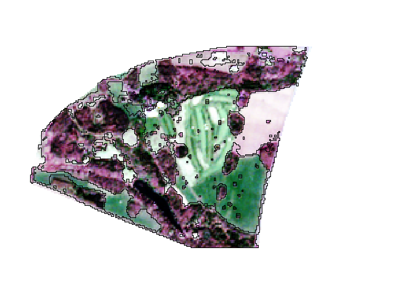

<!-- README.md is generated from README.Rmd. Please edit that file -->

# rasterclassifier

<!-- badges: start -->
<!-- badges: end -->

Simplify machine learning workflows for raster imagery.

## Installation

You can install the development version of rasterclassifier from
[GitHub](https://github.com/) with:

``` r
# install.packages("devtools")
devtools::install_github("tomwilsonsco/rasterclassifier")
```

## Example

``` r
library(rasterclassifier)

# read the example tif included with package as terra spatRaster
example_img <- terra::rast(system.file("test_raster.tif",
  package = "rasterclassifier"
))

# read the example training polygon as sf features
example_polys <- sf::st_read(system.file("test_polys.gpkg",
  package = "rasterclassifier"
))

# read the example mask layer as sf feature
mask_poly <- sf::st_read(system.file("test_mask.gpkg",
  package = "rasterclassifier"
))

# extract pixel values from raster using sf feature collection
pixel_df <- extract_pixels(example_img, example_polys)

# This will run 5 different train test splits,
# then train `randomForest` (default) on training set
# and report different accuracy metrics against the testing set
classif_train_test(pixel_df)

# If happy with metrics then can proceed to train a randomForest
rf <- pixel_df |>
  train_test_split() |>
  features_labels_select() |>
  fit_random_forest()

# Mask the prediction image to area of interest
example_img <- terra::mask(example_img, mask_poly)

# Use the trained model to predict a whole image
pred_img <- terra::predict(example_img, rf, na.rm = TRUE)


pred_features <- sf::st_as_sf(terra::as.polygons(pred_img, dissolve=TRUE)) |>
  subset(class == 1) |>
  sf::st_cast("POLYGON")

# Plot rgb version of raster and prediction polys with red outline
terra::plotRGB(example_img, stretch = "hist", r=3, g=2, b=1)
terra::plot(pred_features, color="black", add=TRUE)
```


